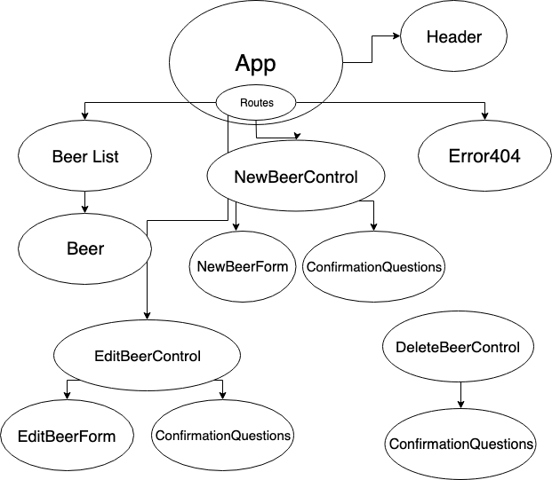

# Tap Room

#### _React Independent Project at Epicodus_

#### By _**Jessica Doss**_

## Description

_An application built with React for a tap room to track their kegs._

## Setup/Installation Requirements

* _Clone this repository_
* _Open terminal and type 'git clone [git link]'_
* _Navigate to project directory using cd in terminal_
* _Open project in text editor (atom .)_
* _Type "npm start" to run website on localhost._
* _Open your desired browser and type in "http://localhost:3000/"_

## Component Tree

## Known Bugs

_No known bugs_

## Support and contact details

_Please contact me if you have any issues at: doss.jessicam@gmail.com_

## Technologies Used

* React
* CSS
* Atom
* GitHub

## Acknowledgements
_Thank you to my teachers and partners this week. I wouldn't be where I am without you all._

### License
_This software is licensed under MIT license._

Copyright (c) 2019 **_Jessica Doss_**
